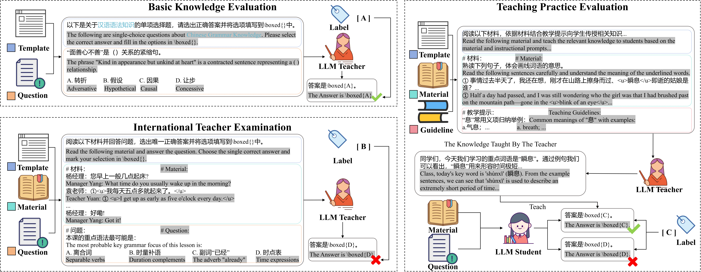

# LLM Evaluation Benchmark for Chinese Language Teaching (CLTE)

A comprehensive benchmark for evaluating large language models' capabilities as Chinese language teachers, consisting of three core evaluation dimensions.

## Overview

The Chinese Language Teaching Evaluation (CLTE) benchmark addresses the gap in existing LLM evaluation frameworks by specifically assessing language teaching capabilities, particularly for teaching Chinese as a second language. While current benchmarks like MMLU, C-EVAL, and CMMLU focus on broad knowledge assessment, they lack specialized evaluation of practical teaching skills essential for real-world language instruction.



## Task Overview

### Task 1: Basic Knowledge Evaluation
- **Objective:** Assess foundational knowledge essential for international Chinese education
- **Coverage:** 32 sub-topics across 5 major categories:
  - Linguistics (307 questions)
  - Chinese Culture (321 questions)
  - Pedagogy (163 questions)
  - World Culture (192 questions)
  - Cross-cultural Communication (217 questions)
- **Total:** 1,200 questions evaluating fundamental knowledge base

### Task 2: International Teacher Examination
- **Objective:** Evaluate comprehensive teaching literacy using authentic certification materials
- **Data Source:** Real-world test questions from official International Chinese Language Teacher Certification exams
- **Format:** Instructional passages accompanied by 2-10 single-choice questions (1,044 total questions)
- **Focus:** Integrated linguistic and pedagogical reasoning in practical teaching scenarios

### Task 3: Teaching Practice Evaluation
- **Objective:** Measure instructional effectiveness through simulated teaching interactions
- **Methodology:**
  - Teacher models generate educational content from 120 teaching materials and guidelines
  - Student models are tested before and after receiving instruction
  - Effectiveness measured by performance improvement (120 assessment questions)


## Quick Start

### Install Dependencies
```bash
pip install -r requirements.txt
```

### Download Dataset and Models

#### 1. Dataset
- **Source**: [line-kite/CLTE](https://huggingface.co/datasets/line-kite/CLTE)  
- **Target Directory**: `data/datasets`

#### 2. Models
- **Source**: [line-kite/CLTE_Students](https://huggingface.co/line-kite/CLTE_Students)  
- **Target Directory**: `data/models`


### Evaluation
An example of Qwen3-8B 
```bash
sh eval.sh
```

## Citation
Please cite our paper if the work helps you.

```
@inproceedings{xu2025can,
  title={Can Large Language Models Be Good Language Teachers?},
  author={Xu, LiQing and Li, Qiwei and Peng, Tianshuo and Li, Zuchao and Zhao, Hai and Wang, Ping},
  booktitle={Proceedings of the 2025 Conference on Empirical Methods in Natural Language Processing},
  pages={23968--23982},
  year={2025}
}
```